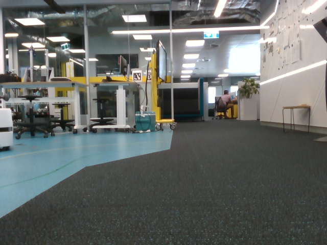
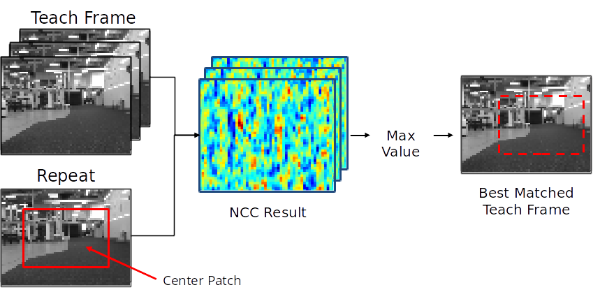

# Competition Links

[Challenge Details](https://roboticvisionorg.github.io/carlie_docs/competitions/robovis2020_vision_challenge_details.html)

# Example Documentation
Below is an example of the documentation we are looking for as part of your submission. Due by 5.00pm (AEST) Tuesday 24th.

## Image Preprocessing Steps
The teach and repeat phase image preprocessing steps are:

1. Convert to grayscale
2. Resolution reduction to 64x48 

<figure float="center" style="margin-bottom: 2em; display: block; text-align: center">
    
    
    <caption> Example of original frame and the frame after preprocessing</caption>
</figure>

## Best Teach Frame Matching Algorithm
The core of our approach is based on normalised cross-correlation (NCC). We compare the preprocessed repeat image to a subset of the teach phase dataset. The subset consists of teach images within a +/- window of the previously best matched teach frame. Our algorithm is as follows:

1. Preprocess repeat image
2. Crop out the center 60% of the processed repeat frame. We shall refer to this cropped portion as the template.
3. Get the teach frame subset - all teach frames within +/- 3 images of the previously matched teach image
4. Compare the template to each image in the teach frame subset using NCC
    - keep track of the current best match (maximum score)
5. The matched teach frame is the one with the maximum score

The preprocessing steps are done on lines 209 to 213. The comparison is performed within a for loop, lines 220 to 233.

<figure float="center" style="margin-bottom: 2em; display: block; text-align: center">
    
    <caption> Abstract Visualisation of the Image Matching Algorithm</caption>
</figure>

## Estimating Current Pose of Carlie
After determining the best match teach frame for the current repeat image we estimate the position of Carlie. This is done by estimating the repeat image position relative to the best matched teach frame. As we utilise NCC, which outputs the position of the template within the compared image, we can utilise this to determine the y-offset (lateral deviation from the path) by using the horizontal pixel position of the template within the best matched teach image. We assume that the x-offset and yaw-offset are both zero. We multiply the horizontal pixel offset by a tuned parameter to estimate the y-offset in metres. This offset, plus 0 offsets for x and yaw, and then passed into the controller to determine command values. The algorithm is as follows:

1. Get the location of the template within the best matched teach frame (performed as part of the NCC process).
2. Determine the horizontal offset, in pixels, of this location. (horizontal offset) = (template width) / 2 - (x location of template in teach image)
3. Multiply the horizontal offset by a tuned parameter to estimate y-offset in metres.
4. Pass [0, y-offset, 0] to the controller to determine command values.

Lines 242 to 248.

## Controller Tweaks
There were no tweaks/changes made to the controller algorithm (you do not need to state changes in parameter values).